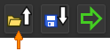
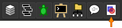
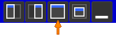

# Voronoi-Diagramm-Generator
Dieses Programm generiert Voronoi-Diagramme für zufällige Repräsentationspunkte und Farben unter Verwendung von Minkowski-Distanzen in TScript https://tglas.github.io/tscript/.

Dabei können Bilder in Form von Bitmaps oder zufällige Farben als Basis für die Farbe der einzelnen Voronoi-Zellen genutzt werden. 
Die Repräsentationspunkte können allgemein als Gitter oder zufällig generiert werden. Für das gegebene Beispielbild der Grapefruit sind zwei weitere Arten der Generierung möglich.
Zunächst wird ein gröberes Gitter aus weniger Repräsentationspunkten generiert. Danach werden entweder zufällige Punkte im Bereich der Grapefruit oder genau außerhalb davon geplottet.

Das Beispiel random_example generiert zufällig gefärbte Voronoi-Zellen für 30 zufällige Repräsentationspunkte für verschiedene Metriken auf einem Bereich von 500 x 500 Pixeln.

Das Beispiel fruit_example generiert Voronoi-Zellen auf Basis eines Bildes für 1024 Repräsentationspunkte und die euklidsche Metrik auf einem Bereich von 1024 x 1024 Pixeln.

# Ausführung
Alle verwendeten Icons sind Teil der TScript IDE. Das relevante Icon ist durch den orangenen Pfeil markiert.

1. Herunterladen des [Voronoi-Generators](voronoiGenerator.tscript).
2. Öffnen der TScript IDE unter https://tglas.github.io/tscript/ und Hochladen der Datei unter

   .

3. Zum Anzeigen der Voronoi-Diagramme muss der Bereich 'Canvas' aus der Programmleiste geöffnet sein. Ist der Canvas noch kein Teil des Arbeitsbereichs kann er ihm über

  

  hinzugefügt werden. Je nach Größe und Platzierung muss der Canvas maximiert werden, um das Voronoi-Diagramm vollständig darstellen zu können. Dazu lassen sich rechts oben im Canvas-Bereich verschiedene Positionierungen für den Canvas auswählen. Für die Maximierung muss

  

  ausgewählt werden. Das Programm kann nun ausgeführt werden. Bei Ausführung sollte darauf geachtet werden, dass links neben dem Startsymbol die richtige Datei ausgewählt ist. Es dauert vor allem bei großen Bildern einen Moment, bis die Repräsentationspunkte der Voronoi-Zellen gezeichnet werden.
